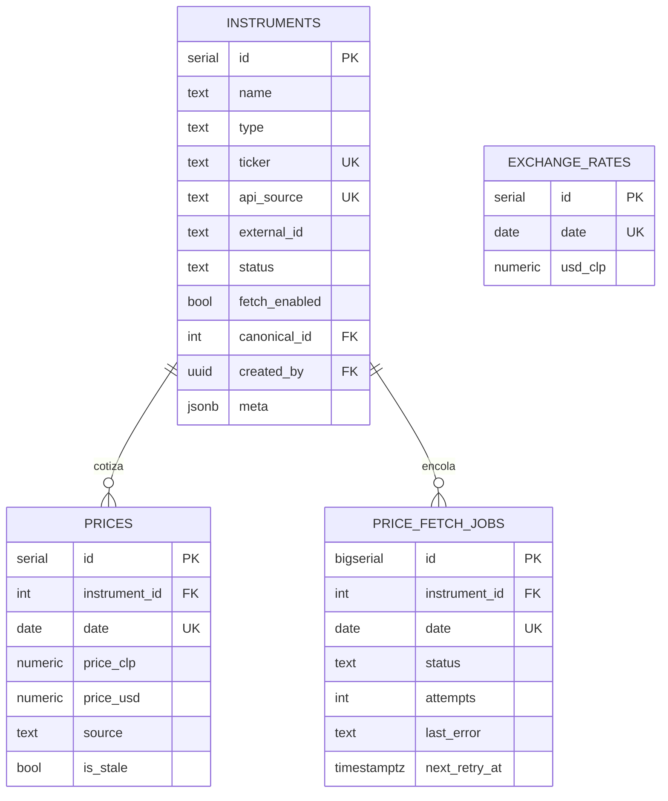
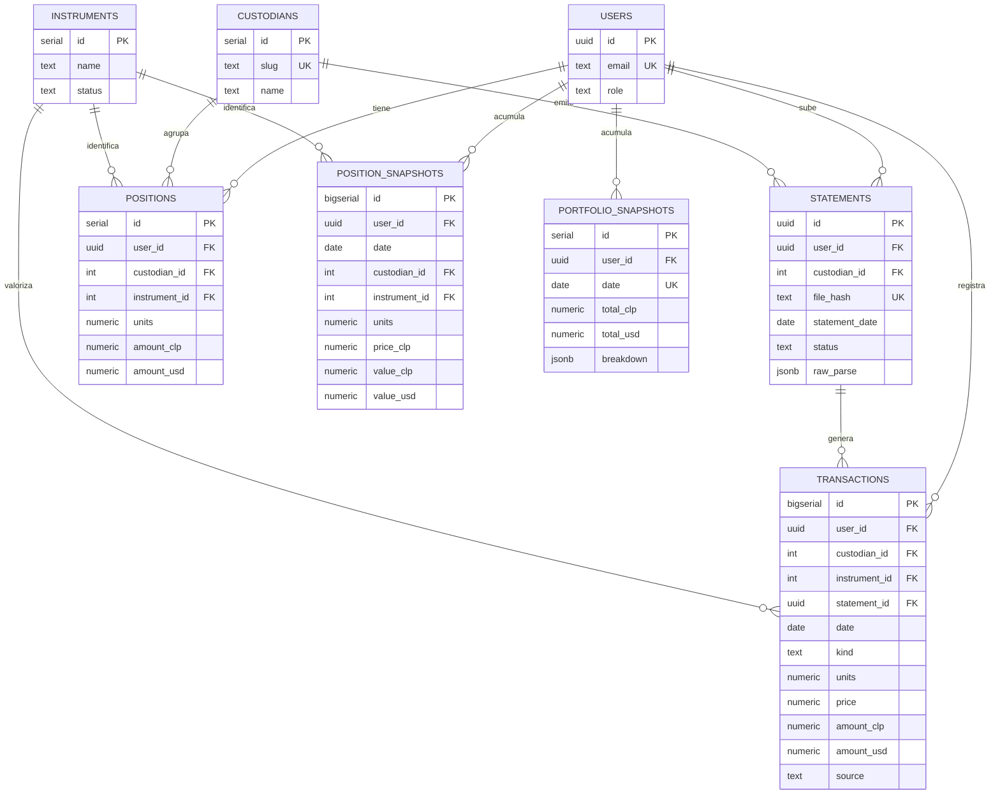

# Plan de escalabilidad

Estado: **Fase 1 y §3.3 en producción. §3.1 implementada.** Siguiente: §2a, el
cron por cola. · Última actualización: 2026-08-31

| Fase | Estado | Rama |
|---|---|---|
| 1 — Fundaciones (ledger, custodios) | ✅ mergeada (PR #5, `2b8dc8f`), migración aplicada y verificada | `feat/fase-1-fundaciones` |
| 3.3 — Snapshots set-based | ✅ implementada, falta aplicar migración 003 | `feat/fase-2-snapshots` |
| 3.1 — Cartola → maestro | ✅ implementada, falta aplicar migración 004 | `feat/fase-2-cartola` |
| 2a — Cron por cola | ⏭ siguiente | `feat/fase-2a-cron` |
| 2b — Cascada de fuentes | pendiente, postergable | `feat/fase-2b-fuentes` |
| 3 — Vistas por custodio y activo | pendiente | `feat/fase-3-analytics` |

Una rama por fase, siempre saliendo de `main` actualizado.

La migración de la Fase 1 vive en
`backend/src/db/migrations/002_fase1_fundaciones.sql`. Ya está aplicada: no hay
que volver a correrla.

Objetivo: que la app aguante muchos usuarios cargando activos arbitrarios, que
los valores cuota se actualicen solos para cualquier activo que alguien haya
subido, y habilitar vistas de rentabilidad por custodio y por activo.

Ya resuelto y fuera de alcance: signup por invitación y solicitud de invitación
(`invitations`, `invitation_requests`, hook `Before User Created`, bandeja admin).

---

## 1. Diagnóstico

### 1.1 El maestro de activos ya existe — es `instruments`

`backend/src/db/schema.sql` ya define `instruments` como tabla global compartida,
y `priceService.js:96` ya recorre todas las filas. Lo que falta no es la tabla:

- **Las cartolas no pueden crear activos nuevos.** En `CartolaUpload.jsx`, si
  Gemini no matchea contra un instrumento existente la fila queda muerta
  (`⚠ Sin instrumento`). Un activo que trae un usuario nunca entra al maestro, y
  el cron nunca lo toma.
- **No hay unicidad.** `instruments` no tiene ningún `UNIQUE` fuera del `SERIAL`.
  El `ON CONFLICT DO NOTHING` de `seed.sql:47` no protege nada: correr el seed dos
  veces duplica los 17 instrumentos. Con usuarios cargando activos vas a tener N
  copias del mismo fondo, con historial de precios fragmentado y N fetches diarios.
- **El prompt manda el maestro completo a Gemini** (`routes/ai.js:47`). Con 20
  instrumentos anda; con 2.000 el costo por cartola explota y el matching empeora.

### 1.2 El cron no aguanta el crecimiento

- `refreshAllPrices()` es un `for` secuencial con `sleep(1000)` por acción de
  Yahoo, **dentro de una sola request HTTP**. GitHub Actions llama con
  `--max-time 120` (`.github/workflows/daily-prices.yml`). Con ~17 instrumentos
  son ~20s; con 200 el curl corta; con 1.000 Render free mata el proceso.
- **Tres caminos escriben precios sin coordinarse**: el node-cron in-process
  (`index.js:77`), `POST /api/cron/prices` desde GH Actions, y `/api/prices/pending`
  + `/batch` del scraper externo (`routes/pricesCron.js`). Ningún lock.
- **No hay estado por instrumento.** Si un fondo falla se hace carry-forward
  `is_stale` y listo: sin reintentos, sin backoff, sin saber que lleva 5 días roto.
- **`snapshotAllUsers()` es el cuello de botella real** (`portfolioService.js:169`):
  itera usuarios en JS y llama `computePositions()` uno por uno, 2+ queries por
  usuario. Con 1.000 usuarios son miles de round-trips en una sola request.
- **Bug de fechas**: `todayISO()` usa `new Date().toISOString()` (UTC) mientras el
  cron corre en `America/Santiago`. Un `/api/prices/refresh` a las 21:30 CLT
  escribe el precio con fecha de mañana.

### 1.3 Las vistas por custodio y por activo hoy son imposibles

- **No existe el concepto de custodio.** Nada en el schema. Y el
  `UNIQUE (user_id, instrument_id)` de `positions` hace que el mismo fondo en dos
  custodios colisione.
- **Los movimientos por posición se guardan con `instrument_id = NULL` hardcodeado**
  (`routes/positions.js:95`). Sin flujos por instrumento no hay TWR por
  instrumento — `computeTWR` justamente filtra `instrument_id IS NULL`.
- **No hay historia de unidades.** `positions` guarda estado actual, no eventos.
  `portfolio_snapshots.breakdown` guarda por *tipo*, no por instrumento ni
  custodio. No se puede reconstruir cuánto valía un activo en una fecha pasada.

**Causa raíz común:** la app guarda estado, no eventos. Todo lo que viene
después (rentabilidad por activo, por custodio, reprocesar cartolas, auditar)
necesita un ledger de transacciones como fuente de verdad, con `positions`
pasando a ser vista derivada.

---

## 2. Fase 1 — Fundaciones (schema)

Habilita todo el resto. Una sola migración.

### 2.1 Tablas nuevas

```sql
CREATE TABLE custodians (
  id      SERIAL PRIMARY KEY,
  slug    TEXT NOT NULL UNIQUE,          -- fintual, racional, vector, buda
  name    TEXT NOT NULL,
  country TEXT DEFAULT 'CL',
  meta    JSONB DEFAULT '{}'::jsonb
);

CREATE TABLE statements (
  id             UUID PRIMARY KEY DEFAULT gen_random_uuid(),
  user_id        UUID NOT NULL REFERENCES users(id) ON DELETE CASCADE,
  custodian_id   INTEGER REFERENCES custodians(id),
  file_hash      TEXT NOT NULL,          -- sha256, idempotencia al resubir
  statement_date DATE,                   -- fecha de valorización del documento
  status         TEXT NOT NULL DEFAULT 'parsed'
                   CHECK (status IN ('parsed','confirmed','discarded')),
  raw_parse      JSONB,                  -- salida cruda del parser
  created_at     TIMESTAMPTZ DEFAULT NOW(),
  UNIQUE (user_id, file_hash)
);

-- Fuente de verdad. Append-only: corregir = insertar un 'ajuste' o un 'saldo'
-- nuevo, nunca editar la fila vieja.
--
-- kind='saldo' guarda el valor ABSOLUTO de la posición a esa fecha, que es lo
-- que realmente dice una cartola. Los demás kinds son deltas.
CREATE TABLE transactions (
  id            BIGSERIAL PRIMARY KEY,
  user_id       UUID NOT NULL REFERENCES users(id) ON DELETE CASCADE,
  custodian_id  INTEGER REFERENCES custodians(id),   -- NULL = nivel portafolio
  instrument_id INTEGER REFERENCES instruments(id),  -- NULL = nivel portafolio
  statement_id  UUID REFERENCES statements(id) ON DELETE SET NULL,
  date          DATE NOT NULL,
  kind          TEXT NOT NULL
                  CHECK (kind IN ('saldo','aporte','retiro','compra','venta','ajuste')),
  units         NUMERIC(20,8),
  price         NUMERIC(20,6),
  amount_clp    NUMERIC(20,2),
  amount_usd    NUMERIC(20,2),
  notes         TEXT,
  source        TEXT NOT NULL DEFAULT 'manual'
                  CHECK (source IN ('manual','cartola','chat','migracion')),
  external_ref  TEXT,
  created_at    TIMESTAMPTZ DEFAULT NOW()
);

CREATE INDEX idx_tx_user_date ON transactions (user_id, date);
CREATE INDEX idx_tx_user_instrument_date ON transactions (user_id, instrument_id, date);
CREATE INDEX idx_tx_user_custodian_date  ON transactions (user_id, custodian_id, date);

-- Historia materializada por activo. Derivada, se puede truncar y reconstruir.
CREATE TABLE position_snapshots (
  user_id       UUID NOT NULL REFERENCES users(id) ON DELETE CASCADE,
  date          DATE NOT NULL,
  custodian_id  INTEGER NOT NULL DEFAULT 0,
  instrument_id INTEGER NOT NULL REFERENCES instruments(id) ON DELETE CASCADE,
  units         NUMERIC(20,8),
  price_clp     NUMERIC(20,6),
  value_clp     NUMERIC(20,2),
  value_usd     NUMERIC(20,2),
  PRIMARY KEY (user_id, date, custodian_id, instrument_id)
);
```

Sin particionar (decisión 6). Volumen: 1.000 usuarios × 15 activos × 365 días
≈ 5,5M filas/año. Con la PK compuesta y los dos índices por bucket, Postgres
aguanta eso por años. Particionar por mes queda como migración futura conocida
y acotada: crear la particionada, copiar, renombrar.

### 2.2 Cambios sobre lo existente

```sql
-- Gobierno del maestro
ALTER TABLE instruments
  ADD COLUMN status        TEXT NOT NULL DEFAULT 'active'
                             CHECK (status IN ('active','pending_mapping','deprecated')),
  ADD COLUMN fetch_enabled BOOLEAN NOT NULL DEFAULT TRUE,
  ADD COLUMN canonical_id  INTEGER REFERENCES instruments(id),
  ADD COLUMN created_by    UUID REFERENCES users(id) ON DELETE SET NULL;

-- Los únicos que impiden el maestro duplicado
CREATE UNIQUE INDEX uq_instruments_source ON instruments (api_source, external_id)
  WHERE external_id IS NOT NULL;
CREATE UNIQUE INDEX uq_instruments_ticker ON instruments (type, ticker)
  WHERE ticker IS NOT NULL;

-- positions pasa a ser caché derivada, con custodio en la key
ALTER TABLE positions
  ADD COLUMN custodian_id INTEGER NOT NULL DEFAULT 0;
ALTER TABLE positions DROP CONSTRAINT positions_user_id_instrument_id_key;
ALTER TABLE positions
  ADD CONSTRAINT uq_positions UNIQUE (user_id, custodian_id, instrument_id);
```

`custodian_id = 0` como sentinela "sin custodio" evita nullables en claves únicas
(en Postgres, NULL no colisiona con NULL, así que un UNIQUE con NULL permite
duplicados). Insertar una fila `custodians (id=0, slug='sin-custodio')`.

### 2.3 Migración de `movements`

`movements` **no se dropea**: se renombra a `movements_legacy` (queda como
respaldo de la migración) y en su lugar va una vista del mismo nombre sobre
`transactions`. Los 17 archivos que la leen no se tocan.

```sql
ALTER TABLE movements RENAME TO movements_legacy;

CREATE VIEW movements WITH (security_invoker = true) AS
SELECT id, user_id, instrument_id, date, kind AS type,
       amount_clp, amount_usd, notes, created_at
FROM transactions WHERE kind IN ('aporte','retiro');
```

`security_invoker = true` no es opcional: sin eso la vista corre con los
permisos de su dueño y **bypasea el RLS** de `transactions`, dejando los
movimientos de todos los usuarios legibles por cualquier autenticado.

La vista es auto-actualizable (un solo `FROM`, sin agregados, columnas simples),
así que los `INSERT`/`DELETE` que ya existen contra `movements` —incluido el de
`admin.js` al borrar un usuario— siguen funcionando mientras se migra el código.

Además, las `positions` actuales se convierten en un `saldo` de hoy. Es el punto
de partida del ledger: sin eso, reconstruir `positions` daría cero.

```sql
INSERT INTO transactions (user_id, custodian_id, instrument_id, date, kind,
                          amount_clp, amount_usd, source, created_at)
SELECT user_id, NULL, instrument_id, date, type,
       amount_clp, amount_usd, 'migracion', created_at
FROM movements;
```

Los `movements` actuales tienen todos `instrument_id NULL`, así que
`computeTWR` a nivel portafolio sigue funcionando igual. **La rentabilidad por
activo arranca desde la fecha de migración hacia adelante** — no hay forma de
reconstruir el pasado. El total del portafolio conserva toda su historia.

### 2.4 RLS

`statements`, `transactions`, `position_snapshots`: política por `user_id`, igual
que `positions`. `custodians`: lectura para autenticados, escritura service role.

### 2.5 Checklist

- [x] Migración `002_fase1_fundaciones.sql`
- [x] Preflight que aborta si el maestro ya tiene duplicados
- [x] Fila `custodians (0, 'sin-custodio')` + seed de custodios reales
- [x] Índices únicos parciales de `instruments`
- [x] `rebuild_position()` / `rebuild_positions_for_user()` en SQL
- [x] Migrar `movements` → `transactions` + vista de compatibilidad
- [x] Políticas RLS de las tablas nuevas
- [x] Dry run completo en Postgres 16 local (preflight, migración, idempotencia,
      unicidad, RLS, la vista `movements` actualizable)
- [x] `services/ledgerService.js`: `setBalance`, `recordMovement`, `closePosition`
- [x] `routes/positions.js`: escribe al ledger y llama `rebuild_position`
- [x] `routes/movements.js`: `INSERT` contra `transactions`
- [x] `routes/custodians.js`: listar y crear custodios
- [x] `computePositions` devuelve `custodian_id` / `custodian_name`
- [x] `PositionForm.jsx`: selector de custodio + alta inline
- [x] Custodio visible en la fila de `Posiciones.jsx`
- [x] `demo/server.js`: endpoint `/custodians` (si no, el modo demo daba 404)
- [x] `npm run verify:ledger` — 15 aserciones de integración, con guardia
      contra bases no locales
- [x] Aplicar la migración en Supabase
- [x] Verificar en Supabase que los totales del portafolio no se movieron
- [x] Mergeada en `main` (PR #5, merge `2b8dc8f`) y desplegada

#### Semántica de `supersede`

El rebuild aplica los deltas con `(date, id) > (saldo.date, saldo.id)`. Un
`ON CONFLICT DO UPDATE` conserva el `id` original del saldo, así que un aporte
cargado *después* del saldo el mismo día queda con `id` mayor y se sigue sumando
encima. Eso hacía que cerrar una posición no la cerrara.

`setBalance({ supersede })` resuelve las dos intenciones:

- `false` (default): el saldo se actualiza en su lugar y los deltas del mismo día
  se mantienen. Es lo que necesita reprocesar una cartola — el resultado no
  depende de cuántas veces corra.
- `true`: el saldo se reinserta con `id` nuevo, así los deltas previos del día
  quedan detrás y se descartan. Es lo que significa que el usuario declare "hoy
  tengo exactamente X", y lo que usan `POST`/`PUT /api/positions` y el cierre.

---

## 3. Fase 2 — Cartola → maestro, y cron resiliente

### 3.1 Cartola

Archivos: `routes/ai.js`, `components/positions/CartolaUpload.jsx`.

1. **Persistir la subida.** La cartola se guarda en `statements` con hash del
   archivo. Da idempotencia (resubir la misma no duplica), reprocesamiento y
   auditoría. Hoy no queda rastro del documento.
2. **Matching fuera del prompt.** Este punto decía "top-10 candidatos y el
   modelo confirma". Al implementarlo quedó claro que el segundo llamado al
   modelo no hace falta: si el prompt de extracción no lleva el maestro —solo
   saca nombre, unidades y montos del documento— el matching se resuelve entero
   en SQL con `match_instruments()`, y la UI muestra el mejor candidato
   preseleccionado con las alternativas y su score. El usuario revisa fila por
   fila igual. Sale más barato, es determinista, es auditable, y el prompt deja
   de crecer con el maestro.

   Dos detalles que costaron encontrar. `similarity()` sola no sirve porque
   castiga la diferencia de largo: `SQM-B` contra `Sociedad Quimica y Minera
   (SQM)` da 0.129 y queda fuera de cualquier umbral razonable, mientras
   `word_similarity()` da 0.667. El score combina las dos y toma la mayor. Y el
   `WHERE` tiene que usar los operadores `%` y `<%`: con `similarity(a,b) > x`
   el índice GIN no se puede usar y es seq scan garantizado. Medido con 60.000
   instrumentos: 3 ms, `BitmapOr` sobre dos `Bitmap Index Scan`.
3. **Sin match → crea el activo.** Se inserta en `instruments` con
   `status='pending_mapping'`, `api_source='manual'`, `created_by=user`. El
   usuario lo trackea por monto igual, el activo **ya está en el maestro**, y
   queda en una cola admin para mapearlo a una fuente de datos. Al mapearlo, el
   cron del día siguiente lo empieza a actualizar solo.
4. **Confirmar escribe `transactions`, no `positions`.** Hoy `POST /api/positions`
   usa `ON CONFLICT DO UPDATE`: subir la misma cartola dos veces **pisa** las
   posiciones sin dejar el valor anterior en ninguna parte.
5. **Un solo request.** `POST /api/statements/:id/confirm` en vez de N llamadas
   desde el browser, cada una disparando un `computeAndSaveSnapshot` completo
   (10 filas = 10 recálculos de todo el portafolio).

- [x] `POST /api/statements` (upload + parse, guarda `raw_parse` con hash)
- [x] Extensión `pg_trgm` + columna generada `search_text` + índice GIN
- [x] **El matching salió del prompt entero**, no solo se redujo
- [x] Alta de `pending_mapping` desde la cartola
- [x] `POST /api/statements/:id/confirm` → `transactions` en una transacción
- [x] Cola admin de `pending_mapping`, con mapeo **y fusión**
- [x] `merge_instruments()`: repunta el ledger, suma la historia y reconstruye
- [x] `CartolaUpload.jsx`: custodio obligatorio, candidatos con score, alta de
      activos nuevos, un solo confirm
- [x] `demo/server.js`: endpoints de `/statements`
- [x] `npm run verify:cartola` — 30 aserciones
- [ ] **Aplicar `004_cartolas_y_matching.sql` en Supabase**

### 3.2 Fase 2a — Cron por cola, con calendario y reintentos

```sql
CREATE TABLE price_fetch_jobs (
  id            BIGSERIAL PRIMARY KEY,
  instrument_id INTEGER NOT NULL REFERENCES instruments(id) ON DELETE CASCADE,
  date          DATE NOT NULL,
  status        TEXT NOT NULL DEFAULT 'pending'
                  CHECK (status IN ('pending','running','done','failed')),
  attempts      INTEGER NOT NULL DEFAULT 0,
  last_error    TEXT,
  next_retry_at TIMESTAMPTZ,
  locked_at     TIMESTAMPTZ,
  UNIQUE (instrument_id, date)
);
CREATE INDEX idx_jobs_claimable ON price_fetch_jobs (status, next_retry_at)
  WHERE status IN ('pending','failed');
```

- **Encolar**: `POST /api/cron/prices/enqueue` inserta una fila por instrumento
  con `fetch_enabled` y sin precio fresco del día.
- **Procesar**: `POST /api/cron/prices/run?limit=25` toma un lote con
  `FOR UPDATE SKIP LOCKED`, responde en <30s y devuelve `{ pending }`. GH Actions
  lo llama en loop hasta `pending = 0`. El tiempo total deja de vivir dentro de un
  timeout de curl.
- **Concurrencia por fuente**: Yahoo 5 en paralelo, CoinGecko serial con su sleep.
- **Reintentos con backoff** sobre `attempts` / `next_retry_at`, y alerta cuando un
  instrumento lleva N días fallando.
- **`pg_advisory_lock`** para que los tres caminos de escritura no se pisen.
- **Matar el node-cron in-process** (`index.js:77`): Render free se duerme igual,
  GH Actions queda como única fuente.
- **Arreglar el bug de zona horaria**: un solo helper `todayCL()` y usarlo en todo
  `priceService.js` / `portfolioService.js`.

#### Calendario de mercado

Hoy cualquier fallo cae en el mismo lugar: `carryForward()` copia el último
precio con `is_stale=true`. Pero ahí están escondidas cuatro situaciones que
piden tratos distintos:

| Situación | Ejemplo | Qué corresponde |
|---|---|---|
| El dato todavía no se publicó | valor cuota CMF, 1-2 días hábiles de rezago | esperar, reintentar mañana |
| El dato no existe para ese día | feriado bursátil, fin de semana en acciones | no hay hueco que llenar |
| El dato existe, la fuente falló | CMF caído, 429 de Yahoo | reintentar, o probar otra fuente |
| El dato no tiene fuente pública | los FIP de Venturance | ahí sí sirve buscar (2b) |

Sin esta capa, cualquier fallback "inteligente" va a fabricar datos para días en
que el valor **todavía no existe**, y un número inventado que se ve igual a uno
oficial es peor que un `is_stale=true`: contamina la rentabilidad sin que nadie
lo note.

Concretamente: calendario de días hábiles bursátiles CL/US, 24/7 para crypto, y
rezago esperado de N días hábiles para fondos CMF y AFP. `fondosCmfFetcher.js`
ya hace media pinta de esto (pide una ventana de 10 días y toma la fila más
reciente); falta formalizarlo y que el resto de los fetchers lo respete.

#### Rellenar huecos hacia atrás

Cuando una fuente vuelve después de estar caída, el cron pide **solo hoy**: los
días que faltaron quedan `is_stale` para siempre. Casi todas las fuentes
soportan rangos — `yahooChart.js` usa el endpoint `chart`, que acepta
`?range=1mo&interval=1d`, así que es un parámetro.

Regla: si el instrumento tiene huecos en los últimos N días, pedir el rango en
vez del punto y hacer upsert de todo.

Importa para los gráficos: un money market plano cinco días por carry-forward y
después saltando de golpe mete un pico artificial en un sub-período del TWR.
Mientras los huecos no estén rellenos, el cálculo de rentabilidad debería
**excluir** los tramos `is_stale`, no tratarlos como precio real.

- [ ] Tabla `price_fetch_jobs` + índice
- [ ] Endpoints `enqueue` y `run`, con advisory lock
- [ ] Workflow de GH Actions en loop hasta `pending = 0`
- [ ] Concurrencia y backoff por fuente
- [ ] Sacar node-cron de `index.js`
- [ ] Helper `todayCL()` y reemplazar todos los `todayISO()`
- [ ] Calendario de mercado por tipo de instrumento
- [ ] Fetch por rango cuando hay huecos
- [ ] Excluir tramos `is_stale` del cálculo de rentabilidad

### 3.2b Fase 2b — Cascada de fuentes con descubrimiento

Esta es la parte "inteligente": qué hace el cron cuando la fuente primaria no
tiene el dato y el calendario dice que **debería** tenerlo.

#### Fuentes ordenadas por instrumento

En vez de un solo `api_source`, una lista con prioridad:

```sql
CREATE TABLE instrument_sources (
  id            SERIAL PRIMARY KEY,
  instrument_id INTEGER NOT NULL REFERENCES instruments(id) ON DELETE CASCADE,
  priority      SMALLINT NOT NULL,
  kind          TEXT NOT NULL,   -- cmf, yahoo, coingecko, sp, http_scrape, web_search, manual
  config        JSONB NOT NULL,  -- url, selector, regex, params
  success_count INTEGER DEFAULT 0,
  failure_count INTEGER DEFAULT 0,
  last_ok_at    TIMESTAMPTZ,
  enabled       BOOLEAN DEFAULT TRUE,
  UNIQUE (instrument_id, priority)
);
```

El worker recorre por prioridad hasta que una fuente devuelva un valor que pase
las validaciones, y `price_fetch_jobs` guarda cuál ganó — así se ve qué
instrumentos viven de la fuente buena y cuáles ya dependen del plan B.

Con `success_count` / `failure_count`, una fuente que falla varios días seguidos
baja de prioridad sola y la que la reemplazó sube. Sin que nadie toque nada.

Para un fondo Fintual la cascada sería CMF → AAFM → sitio de la AGF → búsqueda
web. Para los FIP de Venturance, que hoy están en `manual` porque no tienen API
pública, búsqueda web directo.

#### El LLM descubre la fuente, no lee el precio

Cambio de enfoque importante: **no usar el modelo para leer el precio todos los
días.** Ejecución diaria con LLM es cara, lenta, no reproducible, y cada día es
una nueva oportunidad de equivocarse.

En cambio, cuando un instrumento no tiene fuente o la suya lleva N días
fallando, se dispara un **resolver de descubrimiento**:

1. Búsqueda web (Brave Search API, Serper, o la Programmable Search JSON API de
   Google — scrapear `google.com/search` desde Render no funciona, son IPs de
   datacenter y el CAPTCHA aparece rápido).
2. El modelo lee los candidatos y devuelve **una receta, no un número**: URL,
   dónde está el valor en la página, formato de fecha, moneda.
3. La receta se **valida contra días históricos que ya están en `prices`**. Si
   reproduce los valores conocidos, se guarda como `instrument_sources` con
   `kind='http_scrape'`.
4. Desde el día siguiente es un `fetch` + un selector: cero tokens,
   determinista, auditable.

El costo del LLM decae a casi nada con el tiempo. Y el mismo mecanismo sirve
para proponer el mapeo de los activos `pending_mapping` que entran por cartola
(encontrar el código CMF, el ticker de Yahoo).

#### Guardrails: nada entra directo a `prices`

```sql
CREATE TABLE price_candidates (
  id            BIGSERIAL PRIMARY KEY,
  instrument_id INTEGER NOT NULL REFERENCES instruments(id) ON DELETE CASCADE,
  date          DATE NOT NULL,
  price_clp     NUMERIC(20,6),
  price_usd     NUMERIC(20,6),
  source_url    TEXT,
  raw_excerpt   TEXT,      -- el texto exacto de donde salió el número
  confidence    NUMERIC(3,2),
  status        TEXT DEFAULT 'pending'
                  CHECK (status IN ('pending','accepted','rejected')),
  reject_reason TEXT,
  created_at    TIMESTAMPTZ DEFAULT NOW()
);
```

Tres filtros antes de promover a `prices`:

1. **Cordura numérica.** Rechazar si se desvía más de X% del último precio
   conocido, con X por tipo: 0,5% money market, 5% balanceado, 30% crypto. Solo
   este filtro mata casi todos los errores reales de extracción, que no son
   "alucinó un número" sino "leyó la serie B en vez de la A", "leyó UF en vez de
   pesos", "leyó el patrimonio en vez del valor cuota". Todos caen fuera de
   rango por órdenes de magnitud.
2. **Coherencia de unidad y fecha.** El modelo devuelve moneda y fecha junto con
   el número, y ambas se validan contra lo esperado. Si el dato es del 28 y
   pediste el 31, es un dato viejo, no el que falta.
3. **Cross-check.** Dos fuentes independientes que coincidan dentro de un
   epsilon → `accepted` automático. Una sola → queda `pending` y va a la cola
   admin.

Y en la UI, `source` y `confidence` visibles. Ya existe el precedente de
`is_stale`: esto es un caso más de "este número no es oficial".

- [ ] Tabla `instrument_sources` + migración de `api_source` a la cascada
- [ ] Worker que recorre fuentes por prioridad
- [ ] Auto-reordenamiento por tasa de éxito
- [ ] Tabla `price_candidates` + los tres filtros
- [ ] Resolver de descubrimiento (búsqueda + receta + validación histórica)
- [ ] Cola admin de candidatos `pending`
- [ ] Límite diario de resoluciones con LLM (una fuente caída no puede disparar cientos)
- [ ] `source` y `confidence` visibles en la UI

### 3.3 Snapshots set-based

Reemplazar el loop JS de `snapshotAllUsers` por un `INSERT ... SELECT` que
calcula **todos** los usuarios en una query, poblando `position_snapshots` y
después agregando a `portfolio_snapshots`. O(1) round-trips en vez de
O(usuarios). Es lo primero que revienta al crecer.

```sql
INSERT INTO position_snapshots (user_id, date, custodian_id, instrument_id,
                                units, price_clp, value_clp, value_usd)
SELECT p.user_id, $1, p.custodian_id, p.instrument_id,
       p.units,
       lp.price_clp,
       COALESCE(p.units * lp.price_clp, p.amount_clp, p.amount_usd * fx.usd_clp),
       COALESCE(p.units * lp.price_usd, p.amount_usd, p.amount_clp / fx.usd_clp)
FROM positions p
JOIN latest_prices lp ON lp.instrument_id = p.instrument_id
CROSS JOIN (SELECT usd_clp FROM exchange_rates ORDER BY date DESC LIMIT 1) fx
ON CONFLICT (user_id, date, custodian_id, instrument_id) DO UPDATE
  SET units = EXCLUDED.units, price_clp = EXCLUDED.price_clp,
      value_clp = EXCLUDED.value_clp, value_usd = EXCLUDED.value_usd;
```

- [x] `writeSnapshots(date, userId?)`: una implementación set-based para el cron
      y para las rutas. Round-trips de `3N+1` a **4 constantes**
- [x] `portfolio_snapshots` como agregación de `position_snapshots`, así los
      totales no pueden divergir del detalle
- [x] `DELETE` de filas huérfanas del día (cerrar una posición y re-snapshotear
      el mismo día dejaba la fila vieja y el total no cuadraba)
- [x] Cero explícito para quien se queda sin posiciones pero tenía historia: si
      no, el gráfico se corta en vez de bajar a cero
- [x] Migración `003_indice_snapshots_por_fecha.sql`: en los índices de la 002
      `date` nunca era columna líder, así que el barrido diario hacía seq scan
      de toda la historia
- [x] `npm run verify:snapshots` — 17 aserciones, compara el SQL contra la
      valorización en JS que reemplaza
- [ ] **Aplicar la migración 003 en Supabase**
- [x] Rebuild de `positions` desde `transactions` (entregado en Fase 1:
      `rebuild_positions_for_user()`)

---

## 4. Fase 3 — Vistas por custodio y por activo

Con lo anterior sale casi gratis.

**Backend**

- `GET /api/analytics/by-custodian?from&to`
- `GET /api/analytics/by-instrument?from&to`

Mismo algoritmo de `computeTWR`, pero con la serie de valores del bucket
(`position_snapshots` agrupado por `custodian_id` o `instrument_id`) y los flujos
del bucket (`transactions` filtrado por el mismo campo). Devuelve por bucket:
valor inicial, valor final, aportes netos, TWR %, rentabilidad CLP.

Vale la pena extraer el TWR a una función pura que reciba `(serie, flujos)` y
usarla en los tres niveles: portafolio, custodio, activo.

**Frontend**

Página "Análisis" con dos tabs (Custodio / Activo), reutilizando
`EvolutionChart`:
- área apilada de valor en el tiempo
- barras de rentabilidad % del período
- tabla ordenable: valor, % del portafolio, aportes, TWR

- [ ] `computeTWRFromSeries(serie, flujos)` pura, refactor de `computeTWR`
- [ ] Endpoints `by-custodian` y `by-instrument`
- [ ] Página Análisis con los dos tabs
- [ ] Entrada en `Sidebar.jsx` y `BottomNav.jsx`

---

## 5. ERD resultante

Maestro global — sin `user_id`, escribe el service role, lee cualquier autenticado:



Datos del usuario — todo con RLS por `user_id`:



Notas que el ERD no dice:

- `instruments.canonical_id` es autorreferencia: al detectar un duplicado se
  apunta al canónico en vez de borrarlo, así no se pierde historial de precios.
- `positions`, `position_snapshots` y `portfolio_snapshots` **no** tienen FK a
  `transactions` a propósito: son derivadas, se truncan y se reconstruyen desde
  el ledger.
- `transactions.custodian_id` e `instrument_id` nullables: ambos NULL = aporte a
  nivel portafolio.
- `instruments.created_by` es la única FK que cruza del dominio de usuario al
  global, y es solo trazabilidad.

---

## 6. Decisiones tomadas

| # | Pregunta | Decisión |
|---|---|---|
| 1 | Cartola: ¿saldo absoluto o delta derivado? | **Saldo absoluto.** `kind='saldo'` con las unidades totales a la fecha del documento. Es lo que la cartola realmente dice, y reprocesarla es idempotente. |
| 2 | ¿Custodio en `positions`? | **Sí**, y en la clave única. El mismo activo puede estar en dos custodios. El form lleva selector obligatorio y permite crear un custodio nuevo. |
| 2b | ¿Los custodios que crea un usuario son globales? | **Globales de inmediato**, con `created_by` para trazabilidad y `canonical_id` para fusionar duplicados. La lista real es corta y el autocomplete muestra los existentes primero. |
| 3 | ¿`positions` sigue siendo escribible? | **No: derivada estricta.** Toda escritura entra al ledger y después se llama `rebuild_position()`. Una sola fuente de verdad. |
| 4 | ¿Se dropea `movements`? | **No: vista sobre `transactions`.** Deja la Fase 1 puramente aditiva. |
| 5 | ¿Backfill de `position_snapshots`? | **No, arranca vacío.** Reconstruir hacia atrás con las unidades de hoy daría números falsos. Las vistas por activo dicen desde qué fecha hay datos. |
| 6 | ¿Particionar `position_snapshots`? | **No por ahora.** Tabla plana con PK compuesta; particionar después es una migración acotada. |

Nota sobre la 1: el saldo absoluto obliga a que `rebuild_position()` tome el
último `saldo` como base y le aplique los deltas posteriores ordenados por
`(date, id)`. Si no hay ningún saldo, la base es cero y se suman todos.

## 7. Orden de ejecución

Con la Fase 1 mergeada, el orden ya no depende solo de qué presiona más. Hay un
factor que lo decide: **`position_snapshots` existe y está vacía, y nada la
puebla todavía.**

Como decidimos no hacer backfill —reconstruir hacia atrás con las unidades de
hoy daría números falsos para cualquier activo donde hubo aportes en el medio—
cada día que pasa es un día de historia por activo que no se recupera nunca.
Ninguna otra tarea del plan tiene esa propiedad: todas las demás cuestan lo
mismo hoy que en un mes.

De ahí el orden:

### 1. §3.3 — Snapshots set-based ✅

La única tarea que es urgente por dos razones a la vez:

- **Arranca el reloj de la historia por activo.** Sin esto, las vistas de la
  Fase 3 no tienen nada que graficar cuando lleguen.
- **Arregla el peor cuello de botella de escala.** `snapshotAllUsers` itera
  usuarios en JS con 2+ queries cada uno; es lo primero que revienta cuando
  entren usuarios de verdad.

Rama chica, ~1 día.

### 2. §3.1 — Cartola → maestro ✅

Es la deuda más visible que dejó abierta la Fase 1: `CartolaUpload.jsx` sigue
llamando `createPosition` fila por fila, así que funciona, pero **no pregunta el
custodio** y todo cae en "Sin custodio" — justo en el flujo donde el custodio es
más obvio, porque el documento lo emite un custodio. Y `statements` /
`transactions.statement_id` ya están en el schema sin usarse.

También es lo que desbloquea que el maestro crezca solo, que es la tesis de
escalabilidad de todo esto.

### 3. §3.2 / Fase 2a — Cron por cola, con calendario ← siguiente

Necesario recién cuando el maestro empiece a crecer, y el maestro no puede
crecer hasta que la cartola pueda crear activos. Por eso va **después** de la
cartola, no antes — al revés de lo que decía la versión anterior de este plan.

### 4. §3.2b / Fase 2b — Cascada de fuentes

Postergable sin costo. Hasta que exista, los activos sin fuente siguen en
`manual`, que es lo que ya se hace hoy.

### 5. §4 / Fase 3 — Vistas por custodio y por activo

Necesita profundidad en `position_snapshots`, así que gana con cada semana que
pase desde el punto 1.

---

## 8. Pendientes sueltos

Cosas que no son de ninguna fase pero conviene no perder:

- **`backend/package-lock.json` está desincronizado con `package.json`.** El
  lockfile todavía declara `yahoo-finance2` y su árbol (~983 líneas) pero
  `package.json` ya no la lista, y nada del código la importa — solo queda
  mencionada en un comentario de `services/fetchers/yahooChart.js:2`. `npm ci`
  falla cuando están fuera de sync, así que si el deploy lo usa, está roto.
  Se arregla con un `npm install` en `backend/`, en su propio commit.
- **`movements_legacy` quedó en la base** como respaldo de la migración. No
  borrarla hasta confiar en el ledger por algunas semanas.
- **`instruments.canonical_id` y `custodians.canonical_id` no tienen UI.** Las
  columnas están y los índices únicos impiden nuevos duplicados, pero fusionar
  dos filas ya existentes hoy es SQL a mano. Vale la pena una herramienta admin
  cuando aparezca el primer duplicado real.
- **El bug de zona horaria sigue vivo.** `todayISO()` usa `new Date().toISOString()`
  (UTC) mientras el cron corre en `America/Santiago`: un `/api/prices/refresh`
  disparado a las 21:30 CLT escribe el precio con fecha de mañana. Está en el
  checklist de la Fase 2a, pero es un arreglo de dos líneas que se puede
  adelantar en cualquier momento.
